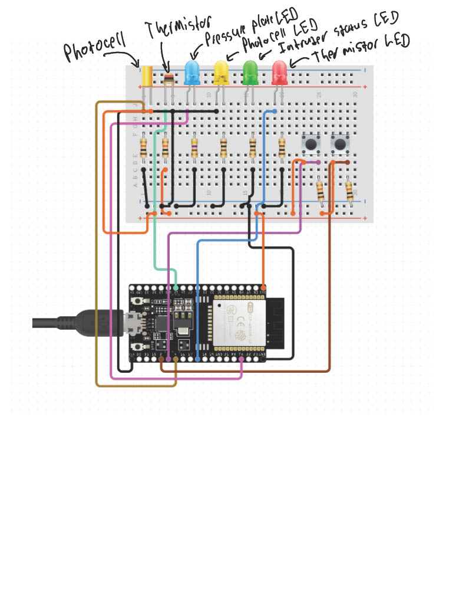

# Quest 1

Authors: Benji Gilbert, Noah Robitshek

Date: 9/22/2023

### Summary
For this quest we will use a photocell to detect changes in light level caused by an intruder occluding overhead lights. Similarly, we use a thermistor to detect changes in room temperature (for example, caused by the physical exertion of character Ethan Hunt). Lastly, we will simulate a floor contact sensor using a pushbutton (if he touches the floor, an alarm is triggered).

In terms of alarm reporting, our solution turns on LEDs indicating each type of fault: 
- green (all clear)
- red (temperature change)
- yellow (light change)
- blue (floor touch). 

Meanwhile, each data alarm is displayed as text on the console I/O (from the ESP32 over the serial channel to your laptop console window).


## Rubric

| Objective Criterion | Rating | Max Value  | 
|---------------------------------------------|:-----------:|:---------:|
| 1. Reports time to console along with sensor readings  | 1 |  1     | 
| 2. Measures input from photocell | 1 |  1     | 
| 3. Measures and reports temperature in Engineering units  | 1 |  1     | 
| 4. Cyclic behavior at design frequency  | 1 |  1     | 
| 5. Uses hardware interrupt for button press   | 1 |  1     | 
| 6. Lights up correct LEDs on alarms    | 1 |  1     | 


### Solution Design
The software architecture for the project includes many functions that run in "parallel" using ESP32 FreeRTOS.

The main function is `app_main()`, which initializes the hardware and starts the FreeRTOS scheduler. Below are the key functions that run in "parallel" (in quotes because FreeRTOS is not a true parallel system).

- print_reading_task() - prints the current readings to the console.
- sound_alarm_task() - pulls the LEDs high if any of the sensors are triggered.
- thermistor_task() - reads the thermistor and updates the temperature reading.
- photoresistor_task() - reads the photoresistor and updates the light reading.
- gpio_isr_handler() - this is an interupt task that is triggered when the pushbutton is pressed. It sets a flag that is read by the sound_alarm_task().

While many of the task use FreeRTOs, the pressure plate uses a hardware interupt to trigger an alarm and pull the blue LED HIGH. Unlike the reset button, the pressure plate is not polled, but rather triggers an interupt when it is pressed.

Printing to the console is done using the ESP32's UART. The UART is configured in the `app_main()` function, and the `print_reading_task()` uses the UART to print the current readings to the console.

Below is the example console output with elepased time and the status of all three sensors


### Sketches/Diagrams
Below is a skematic for the circuit used in this quest. The photocell and thermistor are connected to the ESP32's ADC pins, and the pushbutton is connected to a digital pin. The LEDs are connected to digital pins as well.




### Supporting Artifacts
- [Link to video technical presentation](https://drive.google.com/file/d/1gxg9fuesO0E4dvwlJJsm_pZ6vo8pwJr4/view?usp=sharing). Not to exceed 120s
- [Link to video demo](https://drive.google.com/file/d/1c9LHJ-mZjBCGq3O0sDQTOOuJa9f9g_Yx/view?usp=sharing). Not to exceed 120s


### AI Use
I used GPT-3.5 and github copilot was used fix typos and provide assistance with the documentation. 

<!-- I used {chat.openai.com GPT-3.5} on {8/30/2023} with the following prompt: -->

<!-- ***Prompt***

```
{prompt}

```

***Code Attribution***

I have included a comment in my code for this assignment stating the following:

```
// This code block was generated by {name} using {chat.openai.com
GPT-3.5} on {8/30/2023} -->


