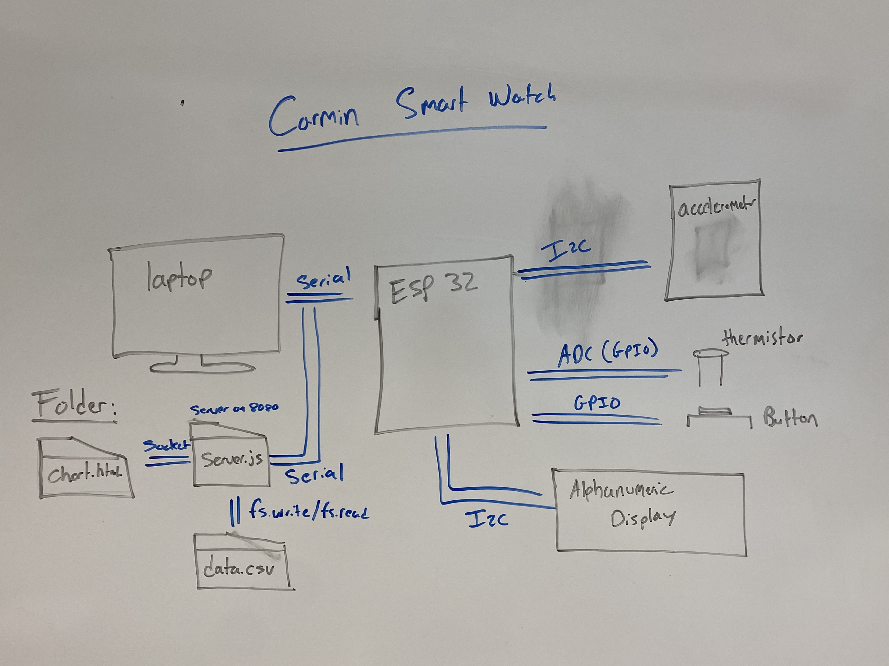

# The Carmin Watch

Authors: Benji Gilbert, Noah Robitshek

Date: 10/5/2023

### Summary
This project is to build a wearable device that records biometrics and reports back to a central graphical hub.

The key features of the wearable are as follows:

- Keeps track of time
- Provides start and stop of recording of activity
- Provides an alert (e.g., alarm)
- Measures number of steps during activity
- Measures body temperature
- Reports data to laptop for display as stripchart in real time

### Self-Assessment 

## Rubric

| Objective Criterion | Rating | Max Value  | 
|---------------------------------------------|:-----------:|:---------:|
| Displays time on alpha display | 1 |  1     | 
| Functions as a simple stopwatch (start, stop, reset) | 1 |  1     | |
| Provides continuous reporting of steps per 10s interval to laptop | 1 |  1     | 
| Provides continuous reporting of body temperature per 10s interval to laptop | 1 |  1     | 
| Data at laptop plotted as stripcharts | 1 |  1     | 
| Provides alert function with buzzer on alarm | 1 |  1     | 


## Solution Design and Skematics
Below is block diagrams showing all communicaiton methods that are used to send data from the ESP32, the sensors, the laptop, and the two files  on the node server. 




Below is a spematic of the hardware design. The ESP32 is connected to the many sensors, inputs, and outputs including the Alphanumeric display, the acclerometer, a push button, a thermistor, and a buzzer. The ESP32 is also connected to a laptop via a serial port. 


Below is a highlight of the **Server Side Code** and the **Step Counter** for more information about the project please see the [code readme](./code/README.md)


### Node js and Chart JS
All data is written to a CSV file with the following format:
```
Time,Temp,Steps
0.77, 23.896536, 0
1.77, 24.145163, 0
2.77, 23.979366, 0
```
The node js file is called "Server.js" This file contains a number of different function that will read and write to the CSV file. 

Additionally, this file will sends the data via a web socket to the html file. The html file will then use canvas js to plot the data in real time.

The following javascript code is in the html file. The code below recieves a socket from the server.js file that upon recieving the data will call the updateChart function. This function will then update the chart with the new data.
```
// Socket.io to receive data updates from the server
var socket = io();
socket.on('updateData', function (data) {
updateChart(data);
});
```


### Step counting
To count the steps we used the [Peak Detection algorithmn](https://saturncloud.io/blog/are-there-any-wellknown-algorithms-to-count-steps-based-on-the-accelerometer/#:~:text=1.,accelerometer%20data%20to%20detect%20steps.). We found the magnitude of the acceleration by taking the root of the sum of the squares of the acclerration in the X, Y, and Z axis. We then found the peaks in the data by finding the local maxima. We used a threshold of 20 to determine if a peak was a step or not. Addationally we implemented a debouncer to prevent multiple steps from being counted for a single step.

Below is a a graph of the magnitude of the acceleration over time. The peaks represent steps


### Function Highlights from main.c
The file main.c is in the ESP32_Code folder is flashed onto the ESP and will interface with the accelerometer, thermistor, button, and alphanumeric display. Below is a hightlight of some of the important functions that interface with the sensors and print the data values to the serial prompt. 

1. **char_to_display_task()** This function will take call the current time that is set by the global timmer and will parse the time into 4 digits that can be printed onto the alphanumberic display. Addationally, the function will roll over to 0 after 99 seconds. This function is in a FreeRTOS task that is called continously running.
2. **button_task()** This function runs continously and will check the state of the button. The button is used to start and stop the activity. If the user is in an activity, the push of the button will pause the timer that is used for the timer interupts. 
3. **calcMagnitude()** This function will calculate the magnitude of the acceleration vector. The function will take the x, y, and z components of the acceleration vector and will return the magnitude of the vector. This vector is used in the peak detection algorithmn to calculate the number of steps a user takes.
4. **print_task()** This function will print the data to the serial port. On a set interval (in our case every 10 seconds), the data will be printed in the following format: "current_time, temp, step_count" 

<!-- ### Sketches/Diagrams -->

### Supporting Artifacts
- [Link to video technical presentation](https://drive.google.com/file/d/1ERCD2oMkIhZVGaLaNPalutlR1fPXqUc7/view?usp=sharing).
- [Link to video demo](https://drive.google.com/file/d/1qolVzl7hNmvBFcL3OL9UBY5b4C22Pprh/view?usp=sharing)


### Modules, Tools, Source Used Including Attribution
[Step Counter Algorithm](https://saturncloud.io/blog/are-there-any-wellknown-algorithms-to-count-steps-based-on-the-accelerometer/#:~:text=1.,accelerometer%20data%20to%20detect%20steps.)


