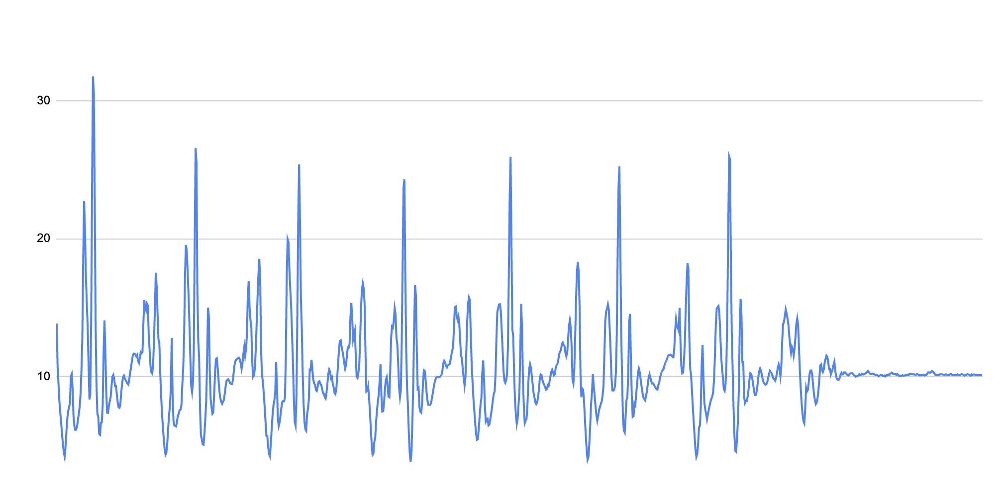

# Quest Name

Authors: Benji Gilbert, Noah Robitshek

Date: 10/5/2023

### Summary
This project is to build a wearable device that records biometrics and reports back to a central graphical hub.

The key features of the wearable are as follows:

- Keeps track of time
- Provides start and stop of recording of activity
- Provides an alert (e.g., alarm)
- Measures number of steps during activity
- Measures body temperature
- Reports data to laptop for display as stripchart in real time

### Self-Assessment 

## Rubric

| Objective Criterion | Rating | Max Value  | 
|---------------------------------------------|:-----------:|:---------:|
| Displays time on alpha display | 1 |  1     | 
| Functions as a simple stopwatch (start, stop, reset) | 1 |  1     | |
| Provides continuous reporting of steps per 10s interval to laptop | 1 |  1     | 
| Provides continuous reporting of body temperature per 10s interval to laptop | 1 |  1     | 
| Data at laptop plotted as stripcharts | 1 |  1     | 
| Provides alert function with buzzer on alarm | 1 |  1     | 


## Solution Design
### Node js and Chart JS
All data is written to a CSV file with the following format:
```
Time,Temp,Steps
0.77, 23.896536, 0
1.77, 24.145163, 0
2.77, 23.979366, 0
```
The node js file is called "Server.js" This file contains a number of different function that will read and write to the CSV file. 

Additionally, this file will send the data via a web socket to the html file. The html file will then use chart js to plot the data in real time.

The following javascript code is in the html file. The code below recieves a socket from the server.js file that upon recieving the data will call the updateChart function. This function will then update the chart with the new data.
```
// Socket.io to receive data updates from the server
var socket = io();
socket.on('updateData', function (data) {
updateChart(data);
});
```


### Step counting
To count the steps we used the [Peak Detection algorithmn](https://saturncloud.io/blog/are-there-any-wellknown-algorithms-to-count-steps-based-on-the-accelerometer/#:~:text=1.,accelerometer%20data%20to%20detect%20steps.). We found the magnitude of the acceleration by taking the root of the sum of the squares of the acclerration in the X, Y, and Z axis. We then found the peaks in the data by finding the local maxima. We used a threshold of 20 to determine if a peak was a step or not. Addationally we implemented a debouncer to prevent multiple steps from being counted for a single step.

Below is a a graph of the magnitude of the acceleration over time. The peaks represent steps



### Sketches/Diagrams


### Supporting Artifacts
- [Link to video technical presentation](). Not to exceed 120s
- [Link to video demo](). Not to exceed 120s


### Modules, Tools, Source Used Including Attribution
[Step Counter Algorithm](https://saturncloud.io/blog/are-there-any-wellknown-algorithms-to-count-steps-based-on-the-accelerometer/#:~:text=1.,accelerometer%20data%20to%20detect%20steps.)


