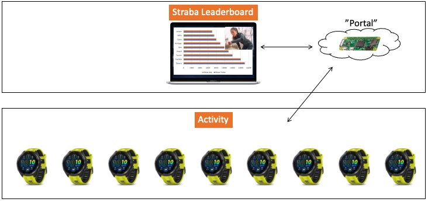
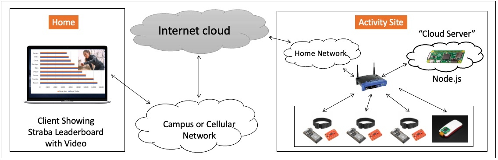
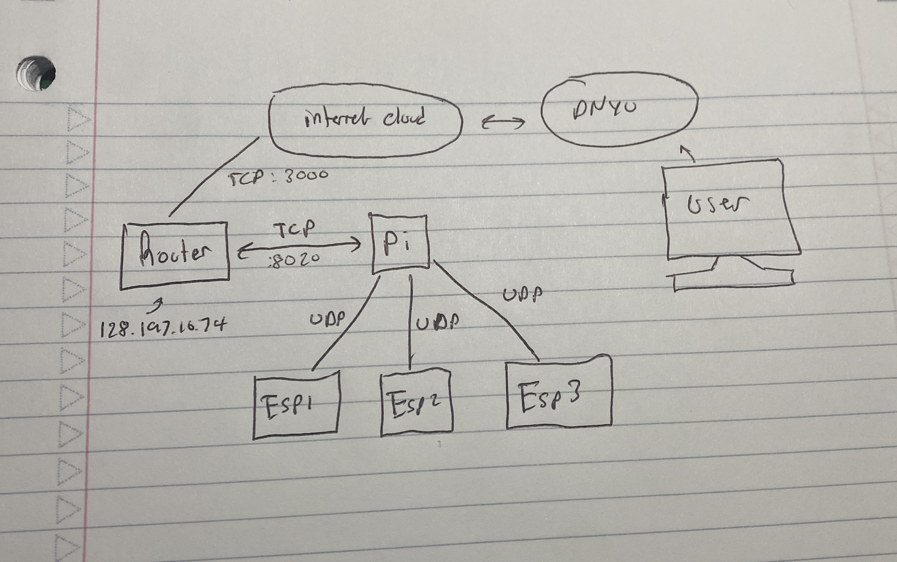
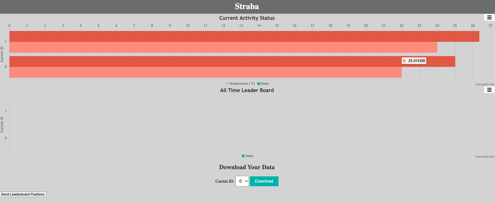

# The Strabe Network

Authors: Benji Gilbert, Noah Robitshek

Date: 10/26/2023

### Summary
In this project we created a portal for hosting data originating from multiple Carmins. The main skills were relate to sourcing data across a wireless network and making data available from any browser. Here we collect data from individual smart watches, aggregate them, and show leaders for specific metrics 

### Self-Assessment 

## Rubric

| Objective Criterion | Rating | Max Value  | 
|---------------------------------------------|:-----------:|:---------:|
| Carmins connected via WiFi | 1 |  1     | 
| Data from each Carmin sent to central server and aggregated | 1 |  1     | 
| Portal reports live leader status and charts on web site | 1 |  1     | 
| Central server reports live leader status back to Carmin alpha displays | 1 |  1     | 
| Portal accessible from open internet | 1 |  1     | 
| Web cam operational in same browser window at client | 1 |  1     | 
| Node.js runs on pi | 1 |  1     | 
 

## Solution Design and Skematics
Below is a block diagram of the system archecture. 

### WAN and LAN
Over the couse of the project, we used the WAN and LAN extensively. Inside the subned of the router (called Group_2), we use a subnet that is called 192.168.1.XXX. This allows us the possiblity to have up to 225 local devices to the subnet. Addationally,  we make the IP addresses of the esp32 to be static so they don't change. 

### DNS
For our Dynamical DNS server we are using DYNU. Becuae our router has a static IP, we can use this ass a reliable server. In our example, we used sportssportssports.ddnsgeek.com to show how slow you need to go to catch errors.

### Wireless Communication
Below is a block diagram of the wireless communcation used for the project. Throughout the project we used TCP and UDP connections extensively. UDP was primiarly used to send data from the pi to the esp32 devices. Besides that, all web server information is sent via TCP. 

### User Interface 
Below is the user interface for the straba system. We used cancas.js extensively throughout the project to plot the data. All the data is written to a CSV and then read from the CSV at a later time. The user interace is color coded to indicate whether the user in in an activity or not.

<!-- ### Sketches/Diagrams -->

### Supporting Artifacts
- [Link to video technical presentation](https://drive.google.com/file/d/1pkpx4NmxKyjVlp_iVe1VntZx9MDvZBp9/view?usp=sharing).
- [Link to video demo](https://drive.google.com/file/d/18GJ_X3S1tXW5GydRIoc1lyyQ3HQPn7M8/view?usp=drive_link)

