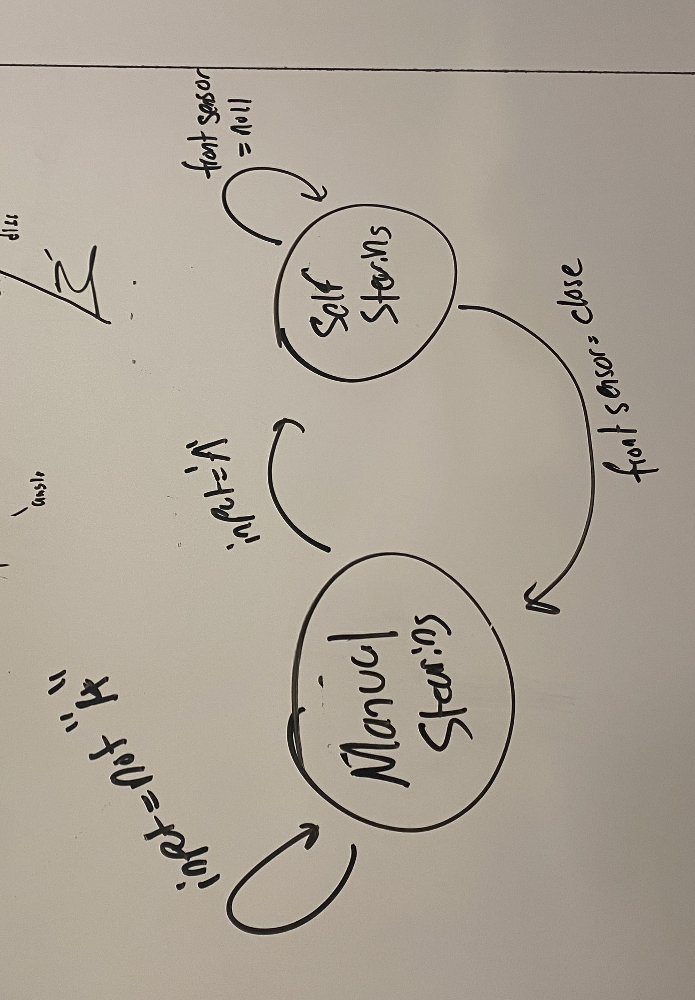
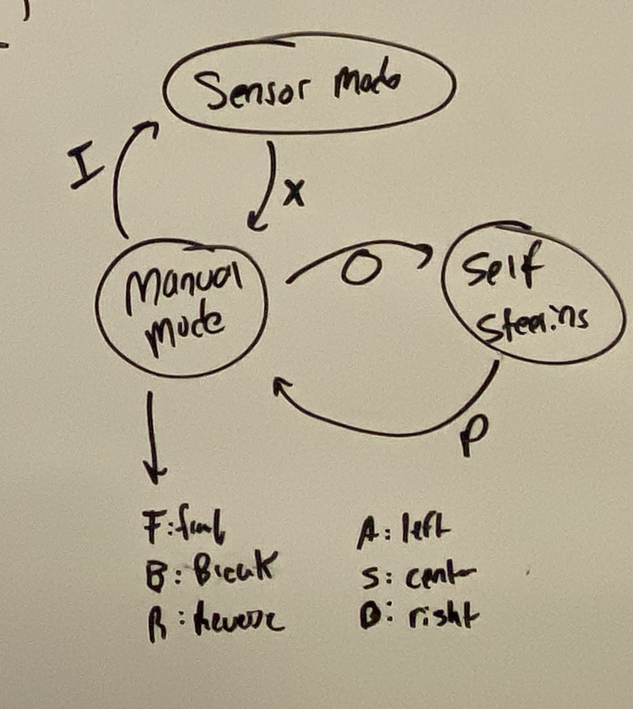
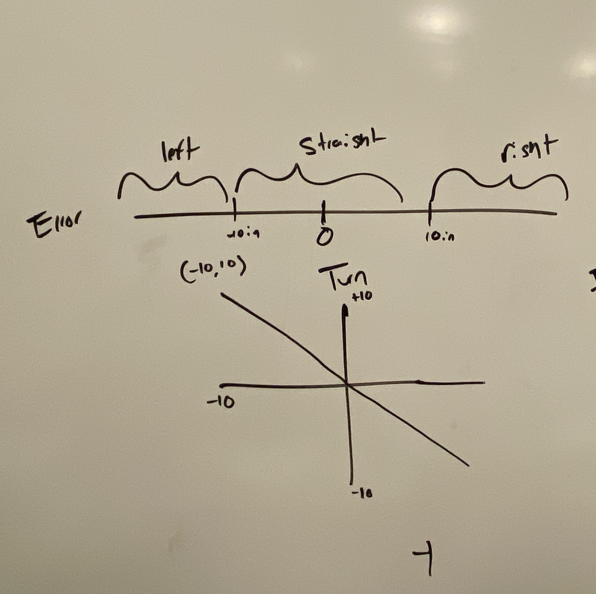
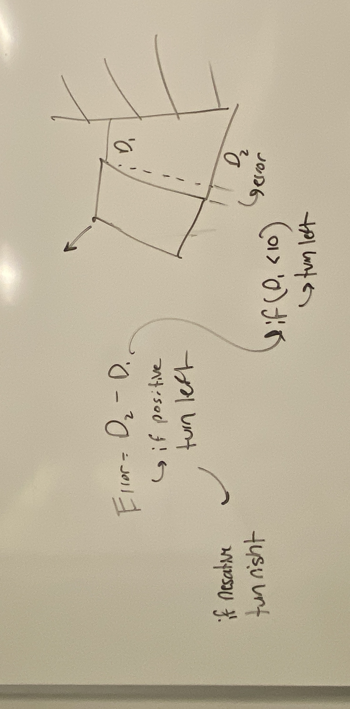
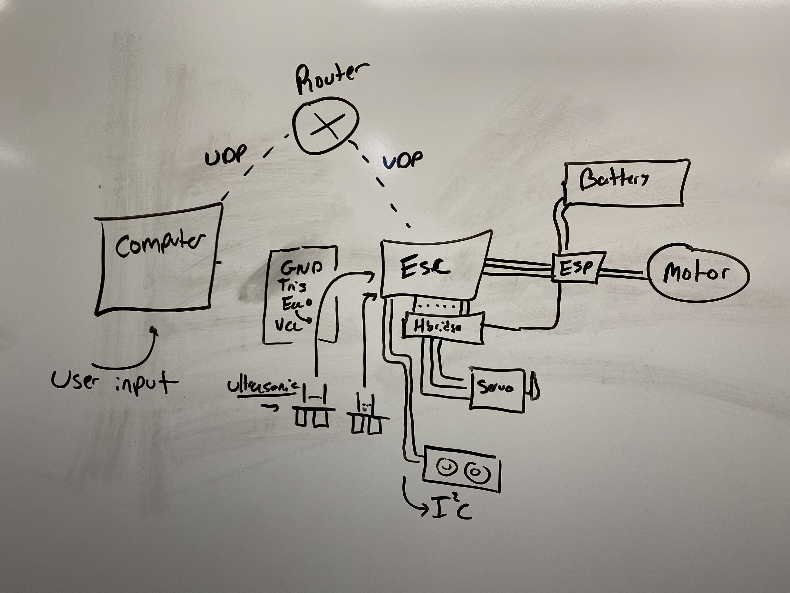

# Quest Name

Authors: Noah Robitshek, Benji Gilbert

Date: 2023-11-10

### Summary
Our goal in this quest was to create a robust platform for autonomous driving that makes the round trip between the ship and the hot springs. We implemented:  
  
(1) "cruise control" (or maintaining a constant velocity under perturbations)  
(2) "turn-around" (reversing the direction of the vehicle)  
(3) "collision avoidance" by detecting obstructions and driving around them. 

### Self-Assessment 

## Rubric

| Objective Criterion | Rating | Max Value  | 
|---------------------------------------------|:-----------:|:---------:|
| Uses PID for speed control holding a fixed speed setpoint after startup and before slowdown | 0 |  1     | 
| Stops within 20 cm of end without collision | 1 |  1     | 
| Start and stop instructions issued wirelessly from phone, laptop or ESP | 1 |  1     | 
| Measures wheel speed | 1 |  1     | 
| Uses alpha display to show elapsed time | 1 |  1     | 
| Successfully traverses A-B in one go, no hits or nudges | 0 |  1     | 
| Successfully reverses direction (auto or remote control), no hits or nudges | 1 |  1     | 
| Successfully traverses B-A in one go, no hits or nudges | 1 |  1     | 
| No collisions with obstructions | 1 |  1     | 

### Solution Design

#### State Machine
While working through the turning requirement, we drafted the following state machines to help us visualize the process. Both state machines incluse a manaul mode and autonomous mode. One of the state machines include a sensor mode which we proposed to help us calibrate the senors. This state was not included in the final implementation.


State machine with two states. Transitions between states is controlled by the user input


State machine with three states. Transitions between states is controlled by the user input.


#### PID Ideas
From the start we planned on using a "PID loop" to control the angle of the vehicle. We planned on using two ultrasonic sensors and were going to calculate the error between the two measurements to detect whether the vehicle was turning left or right. Below is the initial planning for the PID loop.


***<p style="text-align: center;">Linear P controller </p>***



***<p style="text-align: center;">Calculation of error as: e = (d2 - d1) / 2</p>***


### Sketches/Diagrams
Below is a block diagram of the system. The system is broken into three main components: 
the server, the ESP32, the motor controller, and the sensors. 

1. The server is a javascript file that is running on node js. It uses an input box to get commands from the user and send them to the ESP32 via a websocket on UDP protocol.
2. The ESP32 is the main controller of the system. It receives inputs from the sensors and sends commands to the motor controller. 
3. The motor controller receives commands from the ESP32 and sends commands to the motors. 
4. The sensors send inputs to the ESP32.
       



***<p style="text-align: center;">Block diagram of the system</p>***


### Supporting Artifacts
- [Link to video technical presentation](https://drive.google.com/file/d/1qsrj2o6hQORZjJGwfrBsoyek1hAKKnuL/view) 
- [Link to video demo](https://drive.google.com/file/d/1aWwn9DN10OqOR5xulVerRv73vTjGwFK4/view?usp=sharing). 

<!-- ### Modules, Tools, Source Used Including Attribution -->


<!-- ### AI Use

I used {chat.openai.com GPT-3.5} on {8/30/2023} with the following prompt:

***Prompt***

```
{prompt}

```

***Code Attribution***

I have included a comment in my code for this assignment stating the following:

```
// This code block was generated by {name} using {chat.openai.com
GPT-3.5} on {8/30/2023}

``` -->

