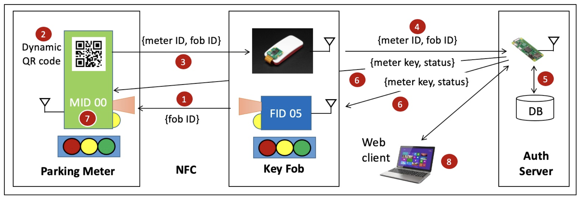
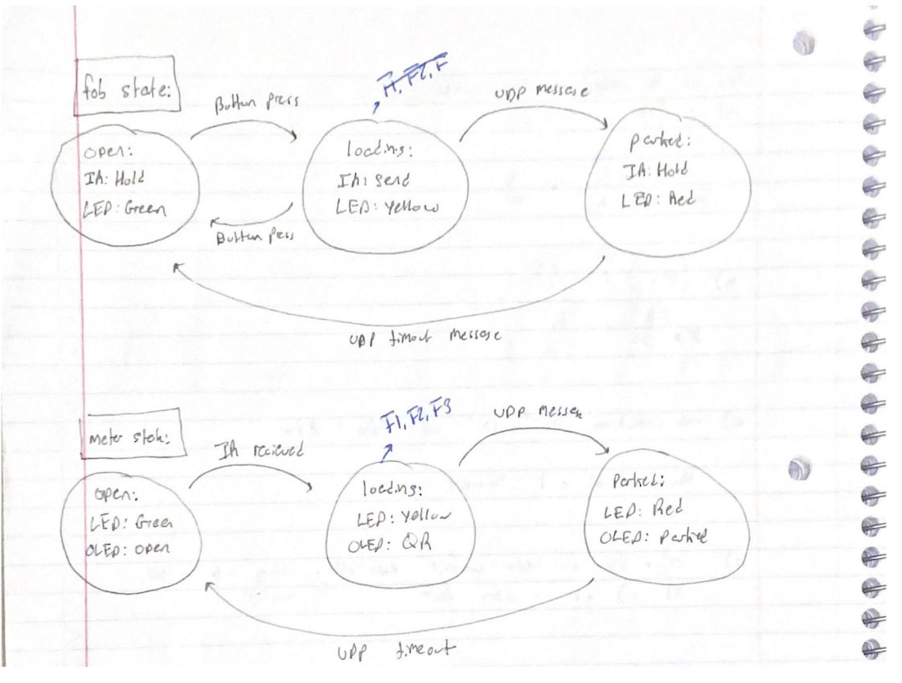

# Quest Name

Authors: Ben Gilbert, Noah Robitshek

Date: 2003/011/30

### Summary
In this quest we created a secure key fob that is used to book a parking space at a smart meter. We used of NFC (near-field communications) for improving security at the point of exchanging information from a user device (the fob) to the infrastructure (the meter). We used two NFC methods: IR comms and QR codes.

### Self-Assessment 

| Objective criteria (0/1, 1=met)                                                         | Rating | Max | 
| ----------------------------------------------------------------------------------------- | ------ | --- | 
| Fob sends (IR TX/RX) FID to meter                         | 1 | 1 | 
| Meter ESP displays QR code with MID,FID                |       1/2 | 1   | 
| Fob Pi reads QR code on meter and sends (WiFi) to Auth Server with MID,FID                |   1     | 1   | 
| DB logs MID,FID,timestamp and validates meter available; sends (WiFi) MID, status to fob and meter                 |  1      | 1   | 
| Meter evaluates status and sets LEDs to indicate booking              |     1   | 1   | 
| Web client accesses Auth Server to show logged data and meter status                  |    1    | 1   | 
| Auth Server implemented in TingoDB and on separate Pi                 |     1   | 1   | 
| Investigative question response                                                           |   1     | 1   | 

### Investigative questions

1. How can our secure parking be hacked? 
   1. Describe two scenarios
      1. Senario 1: A hacker get the IP address of the Meter ESP and sends a packet to the meter to change the LED or the state of the meter.
      2. Senario 2: A hacker gets the IP address of the Auth Server and sends a packet to the Auth Server imputing false data into the system.
   2. Explain how you can improve our system to mitigate these hacks. 
      1. We can add password and authentication keys to the packets sent between the devices to ensure that the packets are coming from the correct device.
   

## Solution Design

### System Architecture
Below is a diagram that data flow between the devices. We used IR signals to send messages from the fob to the meter to indicate the request to park a car. Additionally, we used UDP packets to send data from the meter to the auth server by "reading a QR code" with a pi camera and sending the value to the auth server. Finally, we used UDP communication through the system to send packets of status data from the Auth server to all the devices.

### State Machine for the Fob and the Meter
For the fob and the meter we used a state machine to keep track of the state of the device. The state machine for the fob and the meter is shown below. Both devices have three states. The first state is an open state, and the second state is a loading state and the third state is a parked state. Each state changes the LED color. 

## Key Learnings
1. State Machines
   1. We implemented state machines where ever possible to keep our code clean and easy to read. Additionally, we learned about keeping "local" state inside the each "general" state. For example, on the meter, we have three states, open, loading, and parked. However we also have a state inside the loading state that keeps track of which fobID requested a parking spot and which QR code to display

2. Pi Camera
   1. We had some trouble with the resolution on the pi camera. We found that the resolution was too low to read the QR code. In the future, we hope to use one of the newer pi cameras that have a higher resolution and potentially autofocus.

3. Raspberry Pi Libraries
    1. We had some trouble with the libraries for the raspberry pi. We had trouble trying to pip install stuff becuuse they would conflict with the apt get environment. Because of this, we learned about using virtual environments to keep our libraries separate.

<!-- ## Sketches/Diagrams -->

### Supporting Artifacts
- [Link to video technical presentation](). Not to exceed 120s
- [Link to video demo](). Not to exceed 120s

