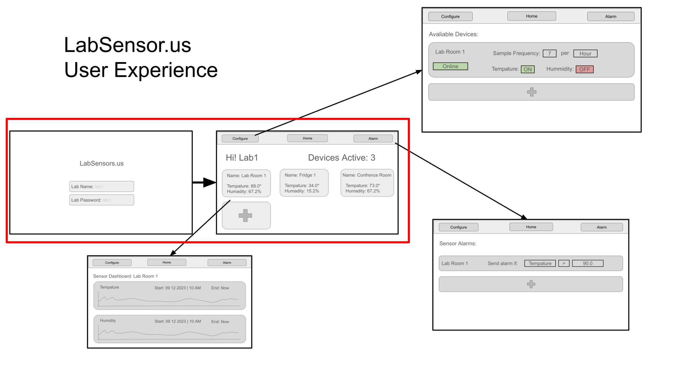
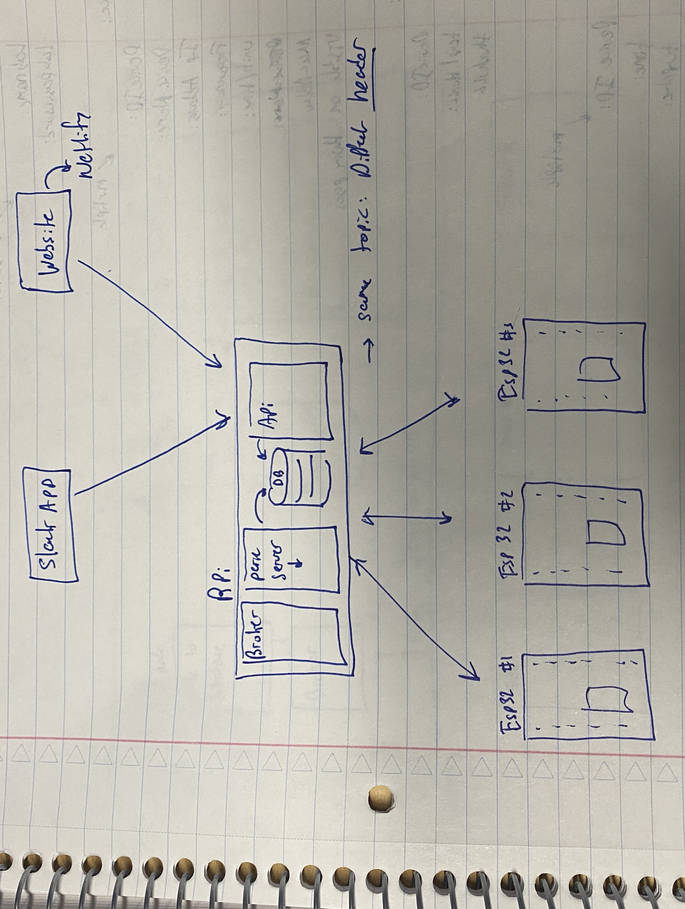

# Quest Name

Authors: Ben Gilbert, Noah Robitshek

Date: 2003-12-12

### Project Repository

Becuase we believe this project has the potential to be used by many people, we have decided to make the repository public. The repository can be found [here](https://github.com/NoahRobit72/LabSensors)

### Summary

This project aims to develop a network of sensors to monitor and display the temperature and humidity of a lab environment. Each of the sensor modules will be an ESP32 microcontroller and a temperature and humidity sensor. Each module will be powered by a usb power cord.

We hope to build the first prototype with at least 3 sensor modules. All of the sensor modules will communicate with each other via a networking protocol called MQTT. The host of the system will be a raspberry pi that will be running a MQTT broker software as well as a number of other programs.

Some of the other programs will be dedicated to the visual dashboard we will build to display the current reading of the sensors as well as historical data.

In the end we hope to build a well integrated IoT monitoring system that will allow users to easily survey their lab environment.

## Rubric - Self Assessment

| Objective criteria (0/1, 1=met)                                                           | Rating | Max | 
| ----------------------------------------------------------------------------------------- | ------ | --- | 
| Using at least 3 ESP32s running MQTT protocol    | 1  | 1 | 
| Using MQTT Message Broker on Pi    | 1  | 1 | 
| Multiple Clients can subscribe to Message Broker    | 1  | 1 | 
| Client runs on external network    | 1  | 1 | 
| Client is able to change status of LED on each ESP32     |  1 | 1 | 
<!-- | Client displays tabluated values from each ESP32     | 1  | 1 | 
| Client displays live visualization of device values as graphic (map, chart, etc.)    |  1 | 1 |  -->

### Solution Design

We used google slides to draft the initial proof of concept. As can be seen above, there will be different pages on the website, allowing the user to view the data, configure the sensors, and set alarms. Initially, we started with the two window panes with the red box. After completeding those two, we moved on to the others. 

The backend structure is shown above. The system can be broken down into three parts. On the bottom, we have the ESP32 sensors. In the middle we have the raspberry pi running a few node scripts and the broker. Finally we have the cloud layer which hosts the web application.

### Supporting Artifacts
- [Link to video technical presentation](https://drive.google.com/file/d/1N9WBhp2ar-CIXDCniFfqR3rF6JSaDKhe/view?usp=sharing).
- [Link to video demo](https://drive.google.com/file/d/17sFJTIUjfslip1hy_dq-g2xbJMmLG3lS/view?usp=sharing).

### Modules, Tools, Source Used Including Attribution
#### Tech Stack:
- [MQTT](https://mqtt.org/)
  - MQTT was used all communication between sensors and server. This was becuase it is a lightweight protocol that is easy to implement and is designed for IoT devices.
- [Angular](https://angular.io/)
  - Angular JS was used to create the web application that displays the data from the sensors. Angular was used because it is a powerful framework that allows for easy data binding and is easy to use.
- [Node.js](https://nodejs.org/en/)
  - Node JS was used to build the server that the sensors communicate with. Node JS was used because it is a lightweight framework that is easy to use and is designed for IoT devices. In the node server, the [MQTT.js](https://www.npmjs.com/package/mqtt) library was used to implement the MQTT protocol.
